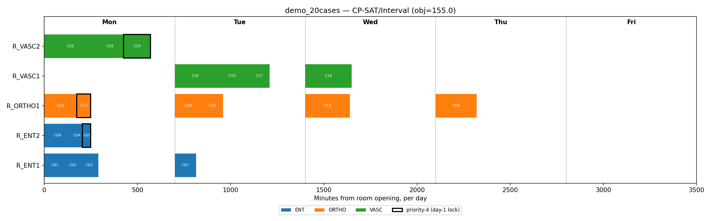
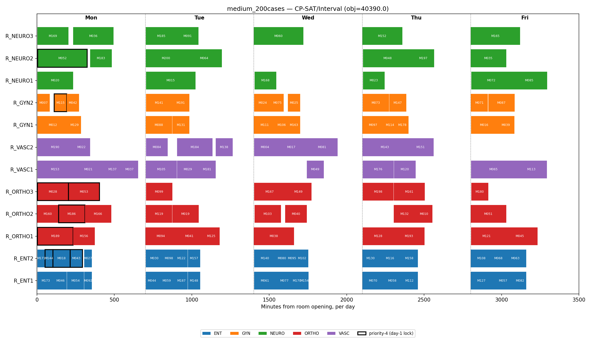

# Elective Surgery Scheduling — Interval-Based Constraint Programming

> A weekly elective-surgery scheduling model for a large hospital group: which
> procedure, in which room, at what time, on which day, with which surgeon. The
> primary model is an **interval-based Constraint Programming** formulation solved with
> **Google OR-Tools CP-SAT**. A Mixed-Integer Program (OR-Tools/CBC, optionally Gurobi)
> is also implemented, purely as the comparison point that justifies that choice.
> **Hexaly** is wired up as an optional, license-gated extension for very large/real-time
> instances — not part of the core deliverable.

Read **[FORMULATION.md](FORMULATION.md)** for the full model (sets, parameters,
variables, objective, constraints, assumptions, and why CP over MIP), then
**[RESULTS.md](RESULTS.md)** for what the demo produces and why it validates that
choice.

---

## Quick Start

```bash
# Core dependency — bundles CBC (the comparison MILP) and CP-SAT (the primary model)
pip install ortools

# Run the 20-case demo on the primary model
python main.py --solver cp-sat

# Save a Gantt-style image of that schedule
python main.py --solver cp-sat --plot demo.png

# Run the ~200-case scaling instance
python main.py --instance medium --solver cp-sat

# Run the instance calibrated to published real CHLN waiting-list statistics
python main.py --instance chln --solver cp-sat

# Optional: compare against the alternative MILP formulation (needs nothing extra)
python main.py --instance demo --benchmark --gap 0.0001

# Optional: commercial backend for the alternative MILP (requires a license)
pip install gurobipy

# Optional: third backend, license-gated, falls back to CBC if absent (see FORMULATION.md §12)
pip install hexaly

# Run the test suite
python tests/test_model.py
```

---

## Repository Structure

```
or-surgery-scheduling/
├── main.py                       # CLI entry point + optional comparison mode
├── FORMULATION.md                # The model: sets, params, variables, objective, constraints, why CP not MIP
├── RESULTS.md                    # Demo results + the CP-vs-MIP comparison that validates the choice
├── README.md                     # This file
├── requirements.txt
│
├── src/
│   ├── model/
│   │   ├── types.py              # SurgicalCase, Surgeon, OperatingRoom, PlanningInstance, SolverResult
│   │   └── penalty.py            # w_c non-scheduling penalty weight
│   │
│   ├── solvers/
│   │   ├── base_solver.py            # Abstract interface — solver-agnostic
│   │   ├── cp_sat_interval_solver.py # OR-Tools CP-SAT, interval-based — PRIMARY model
│   │   ├── milp_baseline_solver.py   # OR-Tools MPSolver (CBC) + native gurobipy — comparison MILP
│   │   ├── hexaly_solver.py          # Hexaly local-search backend — optional, graceful fallback
│   │   └── greedy_solver.py          # Constructive heuristic (warm-start / sanity bound)
│   │
│   ├── data/
│   │   └── instances.py          # demo_instance() · medium_instance() · literature_chln_instance()
│   │
│   └── utils/
│       ├── reporter.py           # Schedule printer + constraint consistency checks
│       └── visualizer.py         # Gantt-style PNG export (--plot)
│
├── tests/
│   └── test_model.py             # Acceptance tests for the primary model + the comparison MILP
│
└── docs/
    ├── img/                            # Generated schedule plots (see "Visual Schedule" below)
    └── or_surgery_scheduling_beamer.tex # Executive slide deck (LaTeX/Beamer)
```

The `.tex` deck mirrors this README/FORMULATION.md — compile with `pdflatex
or_surgery_scheduling_beamer.tex` (run twice) from inside `docs/`, or upload the file
plus `img/` to Overleaf.

---

## The Model, in Brief

**Sets:** cases $C$, days $D$ (one week), rooms $R$, surgeons $H$, shared equipment $E$.

**Decision variables:** for every feasible (case, day, room) candidate — `presence`
(scheduled there or not), `start`/`end` (exact clock time), bundled into one CP-SAT
interval variable; plus an `unscheduled` indicator per case.

**Objective:** minimize a three-term weighted tardiness — prefer scheduling
high-priority, close-to-deadline cases earlier; penalize overdue cases more steeply the
later they're deferred; pay a dominant penalty only when a case truly cannot be fit in.

**Constraints:** one case per patient/week, priority-4 cases locked to day 1,
schedule-or-penalize for everyone else, room-service eligibility, ambulatory/pediatric
carve-outs, exact room/surgeon non-overlap, surgeon daily/weekly time limits, exact
shared-equipment concurrency, and a downstream recovery/ICU-bed constraint.

**Why Constraint Programming, not a bigger MILP:** the problem is fundamentally
disjunctive resource-constrained scheduling — exactly the structure `NoOverlap` and
`Cumulative` were built for, with polynomial-time propagation instead of a big-M
disjunctive encoding. FORMULATION.md §3 makes the full argument; RESULTS.md shows it
empirically against a comparison MILP.

Full math, assumptions, and what's deliberately left out: **FORMULATION.md**.

---

## Results — the Demo, and Why It Validates the Model Choice

Full discussion in **[RESULTS.md](RESULTS.md)**. Headline:

### Demo instance (20 cases, 5 rooms, 6 surgeons)

| Solver | Status | Objective | Gap | Scheduled | Time |
|---|---|---|---|---|---|
| **CP-SAT (primary model)** | Optimal | **155.0** | 0.00% | 20/20 | ~0.1s |
| OR-Tools/CBC (comparison MILP) | Optimal | 157.0 | 0.00% | 20/20 | ~0.03s |

CP-SAT finds a *better* schedule, not by searching harder, but by modeling the shared
C-arm correctly: it checks literal time overlap (`AddCumulative`) instead of a
day-count cap, and so legally places two C-arm cases on the same day, in different
rooms, at non-overlapping times — a schedule the MILP's coarser constraint forbids
outright.

### Medium instance (200 cases, 12 rooms, 17 surgeons), 60-second budget

| Solver | Status | Objective | Gap | Scheduled | Time |
|---|---|---|---|---|---|
| **CP-SAT (primary model)** | Feasible | **41,548.0** | 4.30% | **130/200** | 60.45s |
| OR-Tools/CBC (comparison MILP) | Feasible | 44,346.0 | 0.31% | 128/200 | 60.11s |

The same effect, larger: CP-SAT's objective is **6.3% lower** while scheduling **2 more
cases** — because it searches a strictly larger, correct feasible region, not because
its own convergence is tighter (it isn't: 4.30% vs. 0.31%). A smaller feasible region is
easier to fully close; that's not the same as being a better answer. RESULTS.md spells
this out in full, including the honest "Optimal ≠ 0% gap" caveat for both backends.

---

## Visual Schedule (Gantt-style)

Per the case prompt: "a plain terminal output or a simple image of the schedule is
plenty." Generated with `python main.py --instance <name> --solver cp-sat --plot
out.png` (see `src/utils/visualizer.py`). Each bar is one case; outlined bars are
priority-4 (locked to day 1); colors are surgical service.

**Demo instance, primary CP-SAT model** — real start/end clock times; note Tuesday's
two different C-arm cases, different rooms, non-overlapping times — the schedule the
comparison MILP's day-count equipment cap forbids:



**Demo instance, comparison MILP** — same cases, but with no exact clock times (the
MILP doesn't model any — cases within a room-day are laid out back-to-back in an
arbitrary order):


**Medium instance (200 cases), primary CP-SAT model** — the scaling instance, with
exact per-case start times across all 12 rooms:



---

## Testing Against Real Data

`demo_instance()`/`medium_instance()` are synthetic, literature-*structured*. A third
instance, `literature_chln_instance()` (`--instance chln`), is literature-*calibrated*:
its waiting-time generator reproduces, by construction, the published 2016 CHLN audit
statistics (Marques & Captivo, 2015) — see FORMULATION.md §13 for the numbers and an
explicit discussion of small-sample variance around them. For testing against actual
hospital OR logs at full scale, two CC BY-4.0 datasets are a direct fit:

- Akbarzadeh & Maenhout (2023). *Real life data for operating room scheduling problem*
  (Ghent University Hospital, May 2017). Mendeley Data.
  https://data.mendeley.com/datasets/n2v49z2vnp/2
- Akbarzadeh & Maenhout (2023). *RealLife operating room scheduling dataset,
  2021-Jan-May* — 20 weekly instances, 8 demand/flexibility configurations. Mendeley
  Data. https://data.mendeley.com/datasets/c8d342266x/1

See FORMULATION.md §13 for how their schema maps onto `PlanningInstance` (no
formulation changes needed, just a loader — intentionally not built here, per the
brief's own "small demo" framing).

---

## Open Questions

### 1. Passing the Torch

I'd hand a developer four things: **(1)** FORMULATION.md alongside `src/model/types.py`
— the dataclasses are the data dictionary, one source of truth. **(2)** the solver code
itself, where every constraint is labeled (C1…C11) and the matching code carries the
same label, so reading them side by side leaves no ambiguity. **(3)**
`tests/test_model.py` as the acceptance contract — any reimplementation must pass the
same hard-constraint checks on the same demo instance. **(4)** a short glossary of the
handful of domain terms that aren't self-explanatory (room roster, ambulatory, priority
tiers) — most miscommunication on these projects is vocabulary, not math.

### 2. A Library of Models

Four layers, solver-agnostic except the bottom one. First, core data abstractions —
typed dataclasses, no solver imports — that any model is built on top of. Second,
reusable constraint *patterns* (capacity-sum, no-double-booking via NoOverlap,
tiered-priority tardiness objective, eligibility pre-filter) that recur across
scheduling problems, since nurse rostering and bed allocation need the same shapes, not
the same model. Third, problem templates that compose those patterns — this repo's
model is one such template. Fourth, a thin solver-adapter layer, one file per backend
family (MILP, CP, local search), so a new problem picks a backend without rewriting how
its constraints are expressed. The CP-vs-MILP comparison this repo runs is itself a
template for that last layer: justify the backend choice from the problem's structure
first, verify it empirically on a small instance, then commit — rather than defaulting
to whichever backend is most familiar.

---

## References

See **FORMULATION.md §16** for the full citation list (Cardoen et al. 2010; Marques &
Captivo 2015; Denton et al. 2010; SIGIC; Akbarzadeh & Maenhout 2023 real-data sources;
Vilím 2004; Schutt et al. 2009; OR-Tools CP-SAT documentation).
